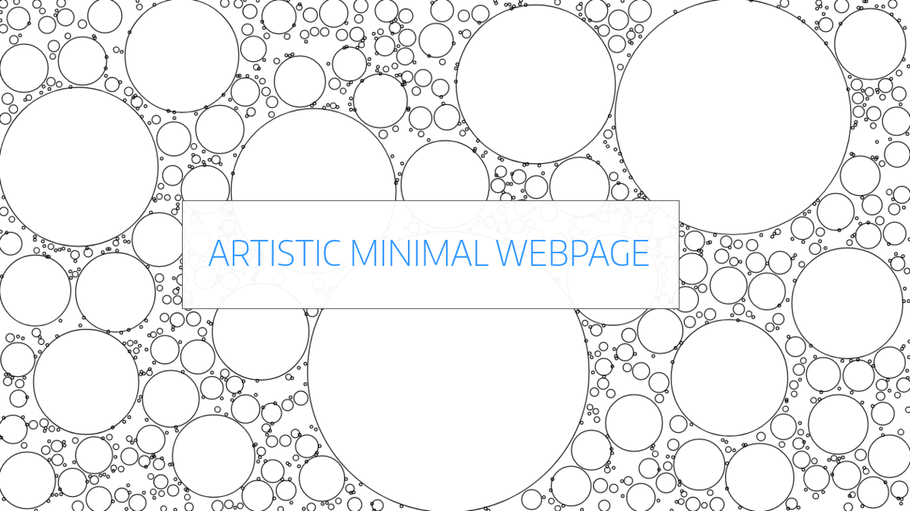
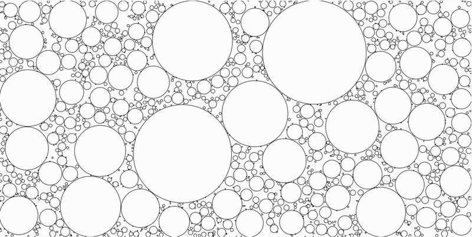

[](https://app.netlify.com/sites/adityaketkar/deploys)
[![Contributors][contributors-shield]][contributors-url]
[![Forks][forks-shield]][forks-url]
[![Stargazers][stars-shield]][stars-url]
[![Issues][issues-shield]][issues-url]
[![MIT License][license-shield]][license-url]
[![LinkedIn][linkedin-shield]][linkedin-url]
[![Twitter][twitter-shield]][twitter-url]


<!-- PROJECT LOGO -->
<br />
<p align="center">
  <a href="https://adityaketkar.netlify.app/">
    
  </a>

  <p align="center">
    A Customizable Personal-Website Template, Ready to Deploy in 10 mins!
    <br />
    <br />
    <a href="https://adityaketkar.netlify.app/">View Demo</a>
    ·
    <a href="https://github.com/adityaketkar/circle-packing-personal-homepage/issues">Report Bug</a>
    ·
    <a href="https://github.com/adityaketkar/circle-packing-personal-homepage/issues">Request Feature</a>
  </p>
</p>


<!-- TABLE OF CONTENTS -->
## Table of Contents

* [About the Project](#about-the-project)
* [Getting Started](#getting-started)
  * [Prerequisites](#prerequisites)
  * [Installation](#installation)
* [Features](#features)
* [Roadmap](#roadmap)
* [Contributing](#contributing)
* [License](#license)
* [Contact](#contact)
* [Acknowledgements](#acknowledgements)


<!-- ABOUT THE PROJECT -->
## About The Project

Want to have strong online presence without spending months coding up a website? 

This project is a FREE, EASY and CUSTOMIZABLE webpage template, made to deploy within 10 minutes  with **NO CODING REQUIRED**!


### Built With
* [Gatsby](https://gatsbyjs.org/)
* [P5.js](https://p5js.org)
* [Dimension](https://github.com/codebushi/gatsby-starter-dimension)


<!-- GETTING STARTED -->
## Getting Started

A webinar with walkthrough of this project is available [here](https://www.youtube.com/watch?v=N9UHOJvtj3E).
The whole tutorial is available in **video format** [here](http://www.youtube.com/watch?v=3A3OzXXQDug) : 

[](http://www.youtube.com/watch?v=3A3OzXXQDug)


If you just want to use the template, no need to clone/download this repo. The following steps show how to launch your own website : 
1. Click the following button 👇 (Make sure you have a Github account before starting)

<a href="https://app.netlify.com/start/deploy?repository=https://github.com/adityaketkar/circle-packing-personal-homepage"></a>

2. After clicking that button, you’ll authenticate with GitHub and choose a repository name. Netlify will then automatically create a repository in your GitHub account with a copy of the files from the template. Next, it will build and deploy the new site on Netlify, bringing you to the site dashboard when the build is complete. 

3. The site should now be live at the URL shown to you by Netlify. Let's now change the content of the site to make it YOURS :)
Firstly, upload all the photos you want to use in your website to [imgur](https://imgur.com/upload). Take a look at the [demo](https://adityaketkar.netlify.app/) to decide what photos you would like to use.

4. Now, open your github account and navigate to the cloned repository (a clone of this project) that Netlify made for you. Then go to 

```src > content > mycontent.json```

5. Press the ```Edit``` butoon on top-right of the file window. 

6. Edit the data present there according to your choice. You should be familiar with the JSON file format. If you're not, no big deal. Take a quick tutorial [here](https://www.youtube.com/watch?v=iiADhChRriM). 

* On imgur, right click on your photo and select ``` Copy Image Location ```. Paste these links in the fields which require URL of photos in ```mycontent.json```
* Array elements are rendered as seperate paragraphs for ```Description``` and ```*Content``` fields. The links are also to be input as Array of JS objects. Explaination on this can be found [here](https://github.com/adityaketkar/circle-packing-personal-homepage/wiki/Guidelines-for-editing-mycontent.json)

7. When done with editing, check the ``` Commit directly to the master branch ``` radio box, add a relevant commit message and click on ``` Commit Changes ```

8. All done! wait for 5 minutes, and visit the URL given to you by Netlify again to confirm changes. 
	
9. Share this repo with people you think can benefit from this project 🙂

**Note** : Change the ```BackgroundURL``` value in ```mycontent.json``` to add a custom background (use imgur to host the background image). Leave it to ```""``` to use the default circle-packing background. Explaination on this can be found [here](https://github.com/adityaketkar/circle-packing-personal-homepage/wiki/Guidelines-for-editing-mycontent.json)

### Possible Errors during Deploying
* Your JSON syntax for `mycontent.json` might be faulty. Validate it using [this](https://jsonlint.com/) tool (Simply copy-paste the contents of `mycontent.json` on the website).

If you're stuck at some point, feel free to raise an issue or reach out to me over any channel.

## For Developers
If you want to contribute to the project or just compile it locally in development mode, follow these steps : 

### Prerequisites

* [npm](https://www.npmjs.com/get-npm)
* [Gatsby](https://www.gatsby.org)

### Installation

1. Clone the repo
```sh
git clone https://github.com/adityaketkar/circle-packing-personal-homepage.git
```
3. Launch dev build using Gatsby
```sh
cd circle-packing-personal-homepage
npm install
gatsby develop
```


<!-- USAGE EXAMPLES -->
## Features
### Responsive Homepage 
<kbd></kbd>


### Compatible with widescreens as well as mobile devices
<kbd></kbd>


### Aesthetic!
<kbd></kbd>


<!-- ROADMAP -->
## Roadmap

See the [open issues](https://github.com/adityaketkar/circle-packing-personal-homepage/issues) and [Github Kanban](https://github.com/adityaketkar/circle-packing-personal-homepage/projects/1) for a list of proposed features and known issues.


<!-- CONTRIBUTING -->
## Contributing

Contributions are what makes the open source community an amazing platform to learn, inspire, and create. Any contributions you can make are **greatly appreciated**.

1. Fork the Project
2. Create your Feature Branch (`git checkout -b feature/AmazingFeature`)
3. Commit your Changes (`git commit -m 'Add some AmazingFeature'`)
4. Push to the Branch (`git push origin feature/AmazingFeature`)
5. Open a Pull Request


Of course, no software is perfect. Let me know your suggestions and feature requests here. You may also suggest changes by forking this repo and creating a pull request or opening an issue :)


<!-- LICENSE -->
## License

Distributed under the MIT License. See `LICENSE` for more information.


<!-- CONTACT -->
## Contact

Aditya Ketkar - [@adityaketkar](https://linkedin.com/in/adityaketkar) - adityaketkar848@gmail.com

Project Link: [https://github.com/adityaketkar/circle-packing-personal-homepage](https://github.com/adityaketkar/circle-packing-personal-homepage)


<!-- ACKNOWLEDGEMENTS -->
## Acknowledgements
* [Best-README](https://github.com/othneildrew/Best-README-Template/blob/master/README.md)
* [Open Source Licence](https://choosealicense.com/)


<!-- MARKDOWN LINKS & IMAGES -->
<!-- https://www.markdownguide.org/basic-syntax/#reference-style-links -->
[contributors-shield]: https://img.shields.io/github/contributors/adityaketkar/circle-packing-personal-homepage.svg?style=flat-square
[contributors-url]: https://github.com/adityaketkar/circle-packing-personal-homepage/graphs/contributors
[forks-shield]: https://img.shields.io/github/forks/adityaketkar/circle-packing-personal-homepage
[forks-url]: https://github.com/adityaketkar/circle-packing-personal-homepage/network/members
[stars-shield]: https://img.shields.io/github/stars/adityaketkar/circle-packing-personal-homepage.svg?style=flat-square
[stars-url]: https://github.com/adityaketkar/circle-packing-personal-homepage/stargazers
[issues-shield]: https://img.shields.io/github/issues/adityaketkar/circle-packing-personal-homepage
[issues-url]: https://github.com/adityaketkar/circle-packing-personal-homepage/issues
[license-shield]: https://img.shields.io/github/license/adityaketkar/circle-packing-personal-homepage
[license-url]: https://github.com/adityaketkar/circle-packing-personal-homepage/blob/master/LICENSE
[linkedin-shield]: https://img.shields.io/badge/-LinkedIn-black.svg?style=flat-square&logo=linkedin&colorB=555
[linkedin-url]: https://linkedin.com/in/adityaketkar
[twitter-shield]: https://img.shields.io/twitter/url?url=https%3A%2F%2Fgithub.com%2Fadityaketkar%2Fcircle-packing-personal-homepage
[twitter-url]:https://twitter.com/Ketkar_A
